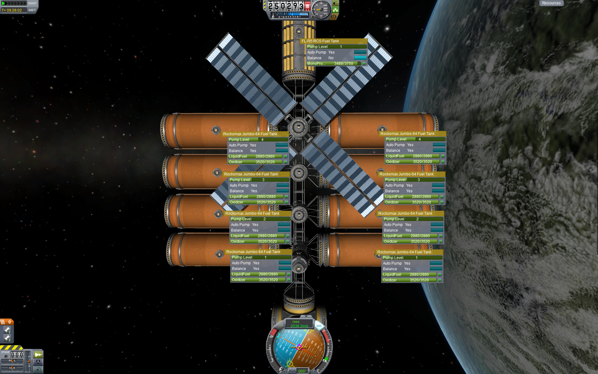
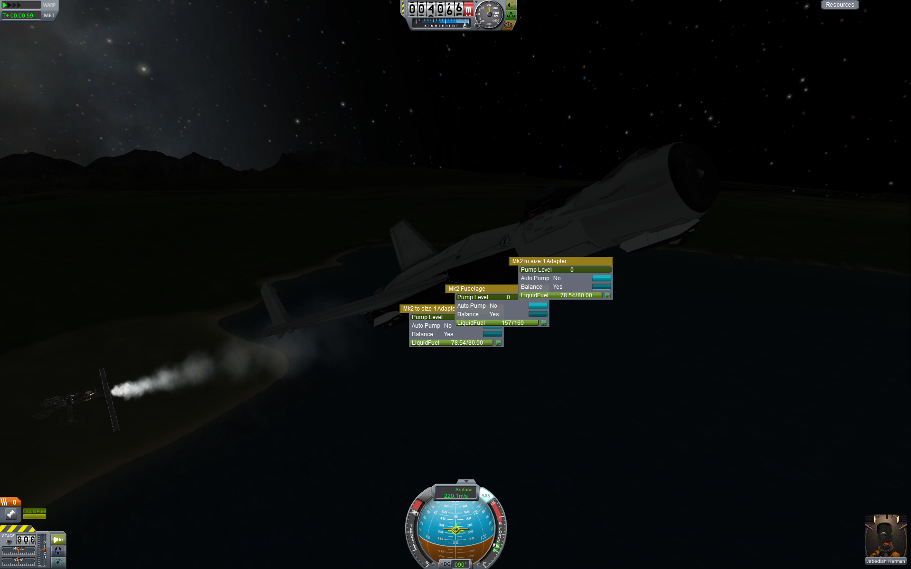
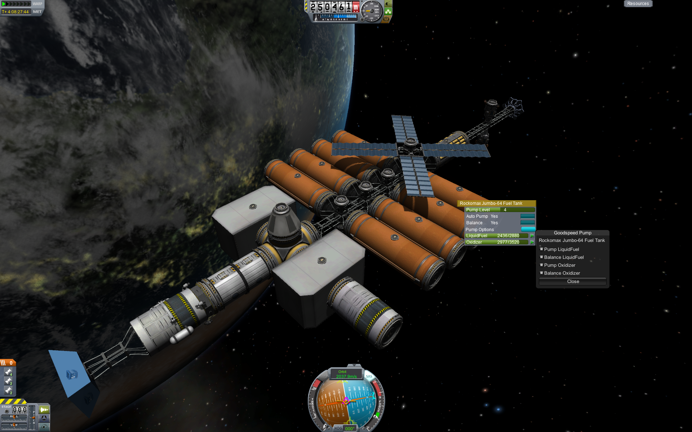

# Goodspeed Pump

## 1

Tanks at higher levels empty first, tanks with the same level maintain left/right balance

## 2

This is just demonstrating that the pump options can be set in the VAB or SPH and saved with the craft.

## 3

Just showing tanks maintaining balance in-flight.

## 4

The Forge orbital construction space station, here demoing the Pump Options window on one of its tanks
